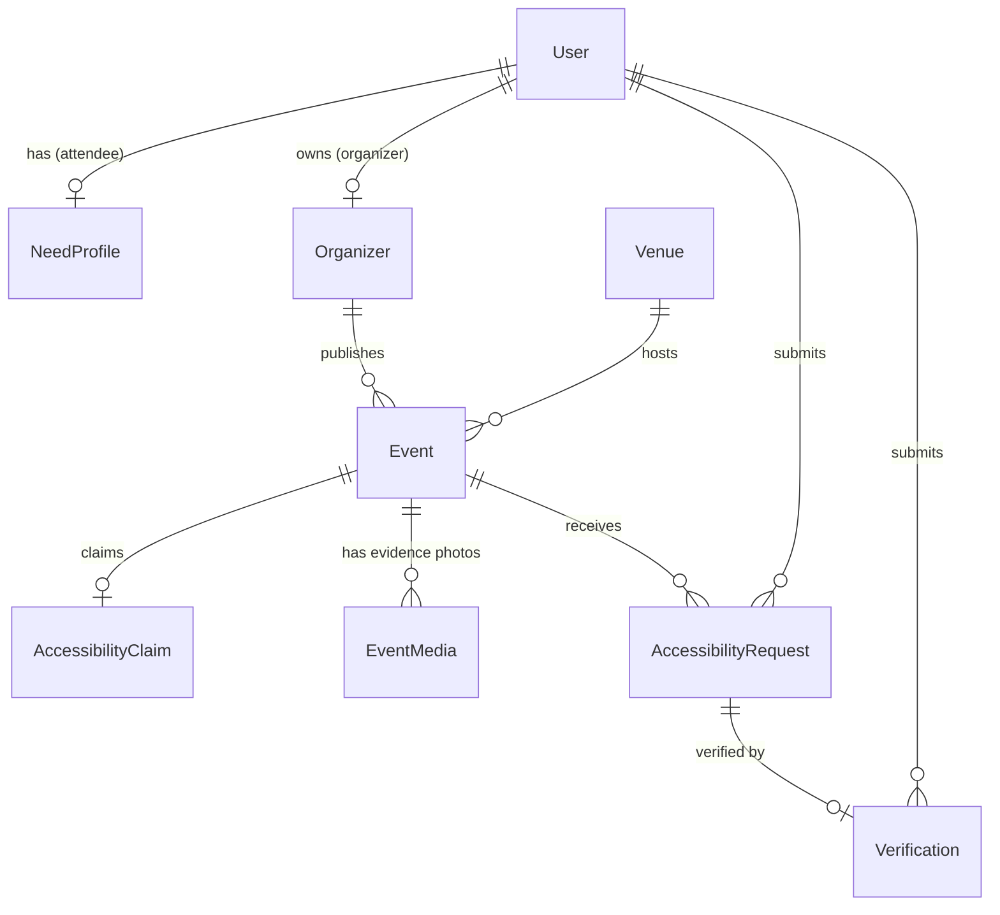
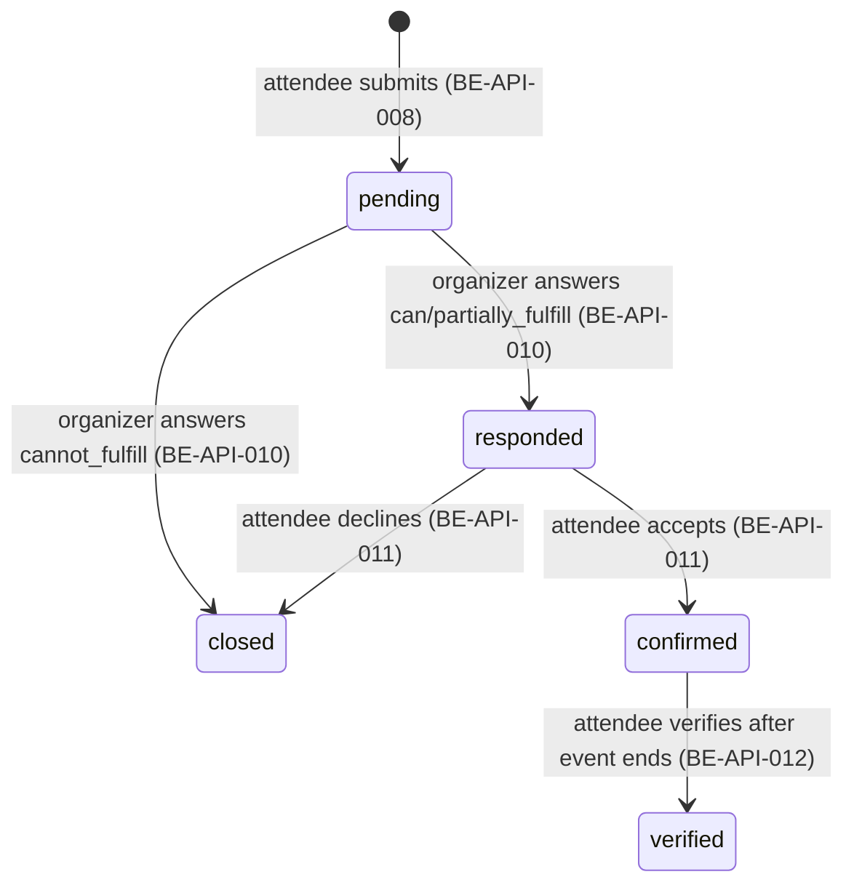

# Architecture (implementation-level)

This document describes how `BE-EventEase` is actually built today, one level
deeper than the README.

## Module layout

FastAPI modular monolith. Each business area under `app/modules/` owns its own
`models.py` (SQLAlchemy ORM), `schemas.py` (Pydantic request/response shapes),
`service.py` (business logic, pure of HTTP concerns), and `controller.py`
(`APIRouter`, thin - role guard, call service, return).

```text
app/
├── core/
│   ├── config.py         # pydantic-settings; reads .env
│   ├── database.py       # engine/session factory (lru_cache'd)
│   ├── dependencies.py   # CurrentUser (JWT bearer), SessionDep
│   ├── errors.py         # APIError + exception handlers -> {"error": {...}} envelope
│   ├── security.py       # JWT encode/decode, PBKDF2 password hashing
│   └── storage.py        # thin Supabase Storage REST client (BE-009)
├── modules/
│   ├── auth/             # demo-login, register, login (BE-API-001/014/015)
│   ├── users/            # NeedProfile CRUD (BE-API-002/003)
│   ├── organizers/       # Organizer profile + get_organizer_reliability (single
│   │                     # source of truth for reliability, see ADR-0004)
│   ├── venues/           # Venue model only - no controller/service/schemas.
│   │                     # Venue is exposed exclusively as an embed inside event
│   │                     # responses; see ADR-0004 in that same doc for why.
│   ├── events/           # Event, AccessibilityClaim, EventMedia + matching
│   │                     # (_compute_match) + list/detail/create + media upload
│   ├── accessibility_requests/  # Request state machine (BE-API-008..011)
│   ├── verification/     # Post-event verification (BE-API-012), calls into
│   │                     # organizers.service for the reliability recompute
│   └── dashboard/         # Attendee dashboard summary (BE-API-019) - pure
│                         # composition over accessibility_requests/events,
│                         # no scoring or request-mapping logic of its own
├── models.py             # re-exports every ORM class so Alembic autogenerate sees
│                         # the full metadata graph regardless of import order
├── seed.py               # idempotent demo fixtures (safe to call twice)
├── cli.py                # `python -m app.cli seed`
└── main.py               # app factory, router mounts, CORS, /healthz
```

`app/main.py` mounts routers under fixed prefixes:

| Prefix | Router |
| --- | --- |
| `/api/auth` | `auth` |
| `/api/events` | `events`, and `media` if `python-multipart` is importable |
| `/api/me` | `users` (needs), `dashboard` |
| `/api` | `accessibility_requests` (`/requests`, `/events/{id}/requests`) |
| `/api/organizers` | `organizers` |
| `/api` | `verification` (`/requests/{id}/verification`) |

The media router is imported inside a `try/except RuntimeError` in `main.py` so a
minimal environment without `python-multipart` still boots the rest of the API -
`python-multipart` is a declared dependency in `pyproject.toml`/`requirements.txt`, so
in any correctly provisioned environment (CI, Docker, Render) the media router is
always mounted. See `docs/adr/0005-supabase-storage-for-media.md`.

## Data model (as built)



Notes that don't show up in an ERD but matter for correctness:

- `Event.venue_id` and `Event.organizer_id` are both `NOT NULL` - every event always
  has exactly one venue and one organizer row, even if that venue's `lat`/`lng` are
  null.
- `AccessibilityRequest.needs_snapshot` and the organizer's `response_note` are never
  overwritten after the fact - verification later needs to compare the *original*
  promise against what actually happened, so both sides of the promise are frozen at
  the time they were made.
- `Verification` has a unique constraint (enforced at the service layer via a
  pre-insert existence check, see `verification/service.py::submit_verification`) -
  one verification per request, ever.

## Request lifecycle (BE-004 / BE-005)



Enforced in `app/modules/accessibility_requests/service.py` and
`app/modules/verification/service.py`:

- Only one *active* request (`pending`/`responded`/`confirmed`) per
  attendee-per-event - `ACTIVE_REQUEST_EXISTS` (409) otherwise.
- `respond_to_request` only accepts a `pending` request; `confirm_response` only
  accepts a `responded` one - any other current state is `INVALID_REQUEST_STATE` (409).
- Only the request's own attendee, and only the owning organizer (resolved via
  `Organizer.owner_user_id`, not by trusting a client-supplied ID), can act on it -
  `FORBIDDEN` (403) otherwise.
- Verification requires `request.status == "confirmed"` **and** the event's
  `ends_at` has passed **and** `event.status == "completed"` - `EVENT_NOT_COMPLETED`
  (409) otherwise.

## Matching (BE-003)

`app/modules/events/service.py::_compute_match` is the single implementation of the
documented weighted-sum formula over the seven accessibility attributes. It
is called from two places - `GET /api/events/{id}/match` (BE-API-006) and the
`sort=match_score` branch of `GET /api/events` (BE-API-018) - so list ordering and the
detail score can never drift apart; see `tests/test_be010.py::test_sort_by_match_score_orders_events_and_reuses_match_formula`,
which specifically regression-tests that the two call sites agree. The dashboard
(BE-API-019) adds a third caller of `calculate_match` (the function wrapping
`_compute_match`), not a fourth path into `_compute_match` itself; see
`tests/test_be011.py::test_dashboard_active_event_matches_direct_match_endpoint`.

## Reliability (BE-005)

`app/modules/organizers/service.py::get_organizer_reliability` is the single
implementation of the 1/0.5/0-average-over-last-20-verifications rule. It used to be
duplicated (with a subtly different weighting) in `events/service.py`; that drift was
found and fixed - see `docs/adr/0004-reliability-scoped-to-organizer.md` for why the
score is scoped to the organizer (not the event, and not the venue) in the first
place, and for the drift-bug history.

Call graph: `verification.service.submit_verification` and
`events.service._organizer_embed` (used by both event list and detail) both call
`organizers.service.get_organizer_reliability` - never their own copy of the formula.

## Error contract

Every error response is `{"error": {"code": str, "message": str, "details": dict}}`,
produced by the two handlers in `app/core/errors.py`: one for the app's own
`APIError` (used everywhere business logic needs to reject a request) and one for
FastAPI's `RequestValidationError` (422, `VALIDATION_ERROR`, with per-field detail).
Controllers never build a JSON error body by hand - they always raise `APIError`.

## Auth

`app/core/dependencies.py::get_current_user` decodes a bearer JWT
(`app/core/security.py`, HS256, `iss`/`aud`/`exp` all enforced) and loads the
matching `User` row, rejecting if the token's `role` claim no longer matches the
stored role. Three ways to get a token, all producing the exact same JWT shape so
downstream code never needs to know which one was used:

1. `POST /api/auth/demo-login` - seeded synthetic accounts only, gated by
   `ENABLE_DEMO_LOGIN`.
2. `POST /api/auth/register` + `POST /api/auth/login` - real accounts, PBKDF2-HMAC
   password hashing (`app/core/security.py::hash_password`, 260k iterations).

See `docs/flows.md` for a walkthrough of the full journey using these endpoints in
order.
